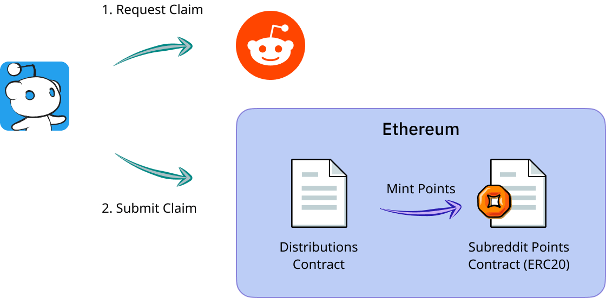
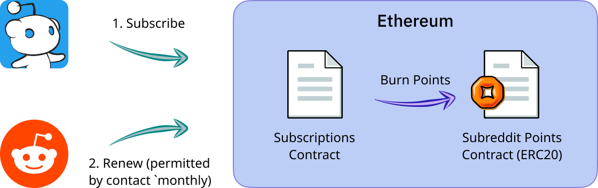

## Usage

### Networks
|Network|Explorer|RPC|
|---|---|---|
|Matic's Mumbai Test network|https://mumbai-explorer.matic.today/|`https://rpc-mumbai.matic.today`|
|Görli Test network|https://goerli.etherscan.io/|`https://goerli.infura.io/v3/<api-key>`|

### Setup

Install dependencies
```bash
$ npm i
```

1. Create secrets.json in the root directory according to the format given in secrets.json.template </br>
2. Insert the privatekey of the reddit contracts in the owner key of secrets.json
3. In the config/default.json mention the goerli rpc endpoint 

for Mumbai test network
```bash
$ export NETWORK=mumbai && node scripts/<test-file>
```

for local Ganache testing
```bash
$ export NETWORK=dev && node scripts/<test-file>
```

## Contract Addresses
(all addresses can be found in `/scripts/helpers/mumbai.json`)
### Network: Mumbai 
|Contract|Address (Mumbai)|
|---|---|
|SubredditPoints|[`0xc4f93FeF8086c452134B0F15a5AE963ACe6A7748`](https://mumbai-explorer.matic.today/address/0xc4f93FeF8086c452134B0F15a5AE963ACe6A7748/transactions)|
|Distributions|[`0xd7ab2634121e7afCE48b2A8Ea5db908869158D3E`](https://mumbai-explorer.matic.today/address/0xd7ab2634121e7afCE48b2A8Ea5db908869158D3E/transactions)|
|Subscriptions|[`0x94B8f2A9a36Be215F2D4211DFee523f204f0a897`](https://mumbai-explorer.matic.today/address/0x94B8f2A9a36Be215F2D4211DFee523f204f0a897/transactions)|
### Network: Görli
|Contract|Address (Görli)|
|---|---|
|SubredditPoints|[`0x0e7e9e6Cc56F356e412F6b7CA63Da0a883243fC0`](https://goerli.etherscan.io/address/0x0e7e9e6Cc56F356e412F6b7CA63Da0a883243fC0)|
|MintableERC20Predicate|[`0x54C39834035d32Fe785557E2c26016F1fFb4C3d4`](https://goerli.etherscan.io/address/0x54C39834035d32Fe785557E2c26016F1fFb4C3d4)|
|WithdrawManager (Proxy)|[`0x2923C8dD6Cdf6b2507ef91de74F1d5E0F11Eac53`](https://goerli.etherscan.io/address/0x2923C8dD6Cdf6b2507ef91de74F1d5E0F11Eac53)|
|FastExit|[`0x8a7490Fc46885e0795051Af9a28A3852A988E34f`](https://goerli.etherscan.io/address/0x8a7490Fc46885e0795051Af9a28A3852A988E34f)|
|ExitNFT|[`0xE2Ab047326B38e4DDb6791551e8d593D30E02724`](https://goerli.etherscan.io/address/0xE2Ab047326B38e4DDb6791551e8d593D30E02724)|

## Workflows
### Mint, transfer, subscribe
Mints, transfers and subscribe work as they would on Ethereum. All three [Reddit's contracts](./contracts/) were deployed on Matic.

**Minting**

User requests a claim from Owner account, and submits the claim to the distributions contract which then (internally) calls Subreddit Points contract to mint tokens.


**Subscriptions**

User submits `subscribe` transaction to place a subscription intent, thereby burning some amount of their tokens.


### Withdraw

Withdraw is a three step process:

1. User burns `X` amount of tokens on the sidechain that they'd like to claim on root chain (Ethereum)
2. The proof of burn transaction is submitted to WithdrawManager contract (on Ethereum). This contract internally verified the burn proof to mint tokens on main chain. This step mints ExitNFT for the user (which is representative of the withdrawn asset)
3. As soon as the Challenge Exit Period ends ([What is Challenge Exit Period?](/docs/withdraw.md)) the user (or any other account) can call `processExits` on WithdrawManager for the token to transfer claimed assets to the users
   
### Fast Exit


If a user would like to skip the Challenge Exit Period (read above), they can submit their ExitNFT along with a signature to swap the tokens from a FastExit contract. Read more about Fast Exit [here](/docs/withdraw.md).


## Scripts

Following scripts can be tested for a *single user* flow

The contracts require signatures from certain accounts throughout the flow (requesting claims to mint new tokens, swapping exit nft for erc20 on Ethereum chain (while withdrawing, read: [What is ExitNFT?](docs/withdraw.md)))
|user|address|
|---|---|
|karmaSource|`0xFd71Dc9721d9ddCF0480A582927c3dCd42f3064C`|
|contracts owner|`0xFd71Dc9721d9ddCF0480A582927c3dCd42f3064C`|
|liquidity provider|`0xFd71Dc9721d9ddCF0480A582927c3dCd42f3064C`|

1. `test1.js`: Test mint, transfer, subscribe
   
   Run:
   ```
   $ node scripts/test1.js
   ```
   To simulate a single user claim, transfer and subscribe on Matic's mumbai test network
2. `test2.js`: Test plasma withdraw
   
   Run:
   ```
   $ node scripts/test2.js
   ```
   To test a single user withdraw from Matic chain (Matic -> Ethereum): Withdraw is a three step process
   
   **2.1 Burn**

   First step (`test2.js`) burns token on Matic and stores a proof
   
   **2.2 Submit proof on Root**

   Run `test2-exit.js`, only after the block with burn transaction has been checkpointed
   Once it has, running `test2-exit.js` will confirm withdrawal of the tokens on root, and mint an ExitNFT for the user. The user can either perform FastExit or perform simple Exit to get their tokens back on Main chain.

   **Resources**
   - [What is Plasma exit and Fast Exit?](/docs/withdraw.md)
   - [What is an ExitNFT?](/docs/withdraw.md)

3. `test3-plasma-exit.js` or `test3-fast-exit.js`: Test plasma exit or fast exit withdraw
   Run: 
   ```
   $ node scripts/test3
   ```

## Helpers
- `scripts/helpers/networkId.js` to query network Id (helpful to get network id when connected to local node - eg., Ganache)
- `scripts/helpers/check-inclusion.js <blockNumber>` to check if blockNumber has been included in checkpoint or not 

## Benchmark Testing

Switch over to `reddit_benchmark` branch to test configure and run performance tests on the deployed contracts.

## Viewing analytics

Click [here](https://dashboard.tenderly.co/public/angela/reddit/analytics/) to view Analytics for the three contracts (Subreddit points, Subscriptions and Distributions) on Tenderly dashboard.
